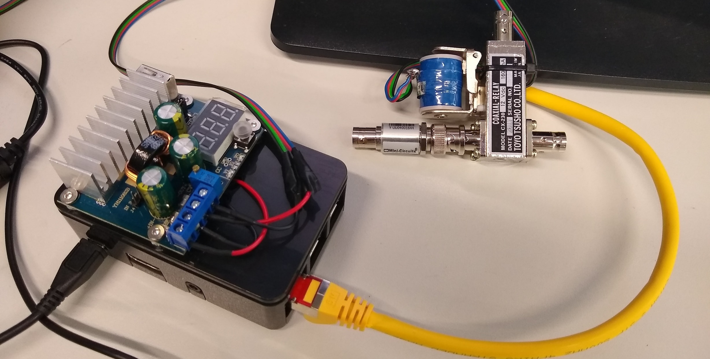
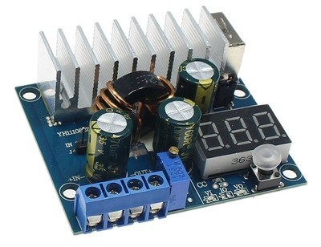
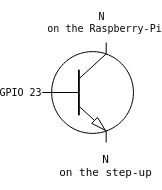
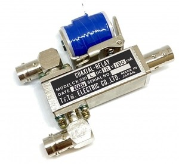
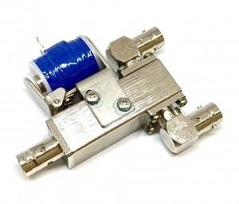
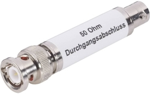

---
Link Disconnection Prototype 

Authors: Paulo H. L. Rettore and Roberto Rigolin F. Lopes 

---

# Link Disconnection Prototype 
[](https://www.fkie.fraunhofer.de)


The link disconnection prototype consists of a relay connected to the coaxial cable of the link between the radios. 
Moreover, the relay needs 12v to work, requiring the use of an adjustable converter module for step-up boost power supply converting 5v to 12v. 
In addition, there is a circuit with a transistor and resistor to open/close the electric pulse and activate the converter module. 
An attenuator also can be used in order to increase the signal resistance provided by the radios and making the relay work properly.

# The prototype components!

The Link Disconnection Prototype is composed by:
   
  - Controller
    - a Raspberry PI 3
    - a step-up device (`DC-DC Converter 5V to 12V`)
    - a switch circuit (`transistor`)
    - server script (`disconnection_server.py`)
  - Coaxial relay (`cx-230l`)
  - Attenuator (`50 ohm`)
  - Client script (`request_disconnection.py`)
    
[]()

### Raspberry PI 3

### Step-up DC-DC Converter 5V to 12V

There are different types of boost step-up modules. 
This prototype used the DC 100W 6A 3-35V to 3-35V Boost Step-up with LED Voltmeter.

[]()

### Circuit

Using a transistor (NPN) and resistor (X ohm) we can activate/deactivate the 
step-up module and as a consequence the RF relay.

[]()

### Coaxial relay

CX230L Coaxial Relay Switch RF 12V BNC

[]() []()

### Server script

```sh
phyton disconnection_server.py -i <RaspberryPi IP> -p <RaspberryPi Port>
```

### Attenuator

Different attenuators can be used, it mostly depends on the radio antenna power, 
and the resistance it requires to the relay really breaks the link, otherwise, 
the link can still in place even the relay is activated.
This prototype used a 50-ohm attenuator.

[]()

### Client script

```sh
phyton request_disconnection.py -i <RaspberryPi IP> -p <RaspberryPi Port> -t <Disconnection time>
```

License
----

GPL