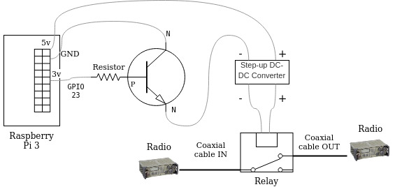

---
Link Disconnection Prototype

Authors: Paulo H. L. Rettore and Roberto Rigolin F. Lopes 

---

# Link Disconnection Prototype 
[](https://www.fkie.fraunhofer.de)

The link disconnection prototype was designed to create real disconnections in Tactical Networks with VHF/HF radio links (not limited to) 
through a low-cost device, allowing the conduction of experiments, to test military systems, over intermittent network conditions.

The prototype consists of a relay connected to the coaxial cable of the link between the radios. 
Moreover, the relay needs 12v to work, requiring the use of an adjustable converter module for step-up boost power supply converting 5v to 12v. 
In addition, there is a circuit with a transistor and resistor to open/close the electric pulse and activate the converter module. 
An attenuator also can be used in order to increase the signal resistance provided by the radios and making the relay work properly.

# The prototype components!

The Link Disconnection Prototype is composed by:
   
  - Link disconnection scheme 
  - Controller
    - a Raspberry PI 3
    - a step-up device (`DC-DC Converter 5V to 12V`)
    - a switch circuit (`transistor and resistor`)
    - server script (`disconnection_server.py`)
  - Coaxial relay (`cx-230l`)
  - Attenuator (`50 ohm`)
  - Client script (`request_disconnection.py`)
    
[]()

### Prototype scheme

[]()

### Controller
#### Step-up DC-DC Converter 5V to 12V

There are different types of boost step-up modules. 
This prototype used the DC 100W 6A 3-35V to 3-35V Boost Step-up with LED Voltmeter.

[]()

#### Circuit

Using a transistor (bc517 NPN) and resistor (226M Ohms 2%) we can activate/deactivate the 
step-up module and as a consequence the RF relay. See the prototype scheme.

#### Server script

```sh
phyton disconnection_server.py -i <RaspberryPi IP> -p <RaspberryPi Port>
```

### Coaxial relay

CX230L Coaxial Relay Switch RF 12V BNC

[]() []()


### Attenuator

Different attenuators can be used, it mostly depends on the radio antenna power, 
and the resistance it requires to the relay really breaks the link, otherwise, 
the link can still in place even the relay is activated.
This prototype used a 50-ohm attenuator.

[]()

### Client script

```sh
phyton request_disconnection.py -i <RaspberryPi IP> -p <RaspberryPi Port> -t <Disconnection time>
```

How to cite
----
If you decided to use this prototype, please, refer to it as:

-  P. H. L. Rettore, J. Loevenich, R. R. F. Lopes, P. Sevenich, "TNT: A Tactical Network Test platform to evaluate military systems over ever-changing scenarios" in IEEE/ACM Transactions on Networking, vol. X, pp. XXX, 2021, doi: XXX.

Publications
----

- P. H. Balaraju, P. H. L. Rettore, R. R. F. Lopes, S. M. Eswarappa and J. Loevenich, "Dynamic Adaptation of the User Data Flow to the Changing Data Rates in VHF Networks: An Exploratory Study," 2020 11th International Conference on Network of the Future (NoF), Bordeaux, France, 2020, pp. 64-72, doi: 10.1109/NoF50125.2020.9249226.

- R. R. F. Lopes, J. Loevenich, P. H. L. Rettore, S. M. Eswarappa and P. Sevenich, "Quantizing Radio Link Data Rates to Create Ever-Changing Network Conditions in Tactical Networks," in IEEE Access, vol. 8, pp. 188015-188035, 2020, doi: 10.1109/ACCESS.2020.3027797.

- R. Rigolin Ferreira Lopes, P. Hanavadi Balaraju, P. H. Lopes Rettore and P. Sevenich, "Queuing over Ever-changing Communication Scenarios in Tactical Networks," in IEEE Transactions on Mobile Computing, doi: 10.1109/TMC.2020.3005737.

Contacts
----

paulo.lopes.rettore@fkie.fraunhofer.de

roberto.lopes@fkie.fraunhofer.de

License
----

GPL