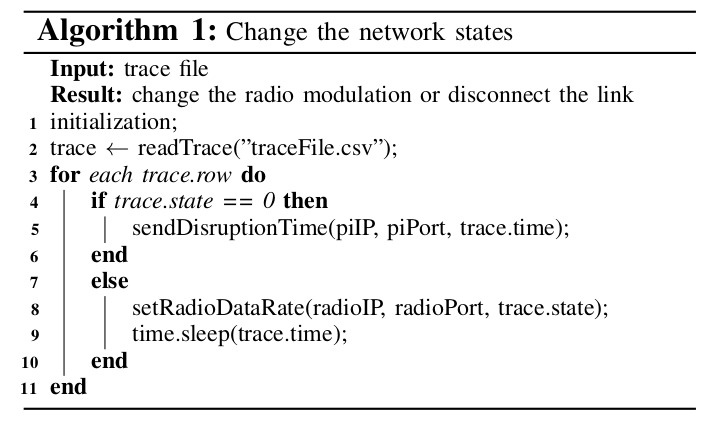
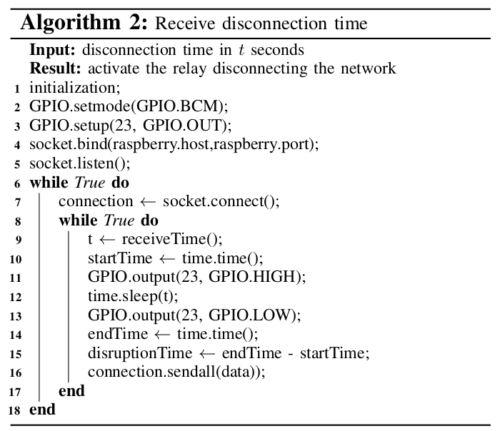

# Link Disconnection Prototype 

The link disconnection prototype was designed to create real disconnections in Tactical Networks with VHF/HF radio links (not limited to) 
through a low-cost device, allowing the conduction of experiments to test military systems over intermittent network conditions.

The prototype consists of a relay connected to the coaxial cable of the link between the radios. 
Moreover, the relay needs 12v to work, requiring the use of an adjustable converter module for step-up boost power supply converting 5v to 12v. 
In addition, a circuit with a transistor and resistor opens/closes the electric pulse and activates the converter module. 
An attenuator can also be used to increase the signal resistance provided by the radios and make the relay work properly. 
Finally, the Raspberry Pi is a controller that deactivates/activates the relay in a specified time interval, causing connection/disconnection. 

# General algorithm explanation 

The changes on the network can be done by using the mobility trace as input and two different interfaces depending on the node state (i) connected: 
the interface with the radio (to change its modulation) and (ii) disconnected: the interface with the link disconnection prototype (to 'cut' the wired antenna using a relay). 
If the network state is '0', the script sends a message to the controller to disconnect the link. 
Otherwise, a different action could occur, such as changing the radio link data rate. 
Algorithm 1 shows the pseudo-code describing these actions, supposing each node has its trace file containing the states ('connected' or 'disconnected'). 
After the necessary initialization in line 1, the trace file is read in line 2, and the node time series and its correspondent states are extracted. 
Then, the time interval between observations is computed and saved (trace). 
For each node observation (line 3), a condition (lines 4 and 7) determines which procedure will be performed next. 
If the node state is 0, then a socket is created to connect to the disconnection controller using the IP address and the port number (line 5). 
After the link disconnects, the client receives data from the server, unlocking the client to go to the next network state. 
If the node state is not 0, the radio modulation will change (line 8). 
The function to set the radio data rate uses as parameters the radio IP, radio port, and the network state (trace.state). 
Finally, in line 9, the client sleeps for the given time window (trace.time) corresponding to the node mobility, for instance, and the process starts again to set the next network state or to finish the test.

[]() 

Algorithm 2 explains the program implemented on the server side to listen to disconnection requests. 
After the initialization in line 1, lines 2-3 define the motherboard  model,  and  the 23rd General  Purpose  Input/Output(GPIO) pin is set for output. 
In Lines 4 and 5, a socket is bound to the Raspberry port and listens for connection requests from the  client.  
If  there  has  been  a  request  (line  6),  a  connection is  established  in  line  7. If  the  connection  establishment  was successful  (line  8),  then  the  time  interval(t) is  received  from the  client  (trace.time)  in  line  9.  
The  current  time  is  saved as the start time of the disconnection (startTime) in line 10. GPIO  is  set  high  to  start  the  relay,  which  causes  the  cable to disconnect  (line  11).  
The 16th pin  port  in  the  assembly architecture is GPIO23. The disconnection is continued in line 12  for  the  specified  time  interval(t).  
GPIO  is  set  low  to  stop the relay, which causes the connection to be re-established in line 13. The current time marks the end of the disconnection time(endTime) in line 14. The time interval of the disconnection is  calculated  in  line  15  (endTime−startTime)  and  
this information is sent back to the client in line 16.

[]()


# The prototype components!

The Link Disconnection Prototype is composed by:
   
  - Link disconnection scheme 
  - Controller
    - a Raspberry PI 3
    - a step-up device (`DC-DC Converter 5V to 12V`)
    - a switch circuit (`transistor and resistor`)
    - server script (`disconnection_server.py`)
  - Coaxial relay (`cx-230l`)
  - Attenuator (`50 ohm`)
  - Client script (`request_disconnection.py`)
    
[]()

### Prototype scheme

[]()

### Controller
#### Step-up DC-DC Converter 5V to 12V

There are different types of boost step-up modules. 
This prototype used the DC 100W 6A 3-35V to 3-35V Boost Step-up with LED Voltmeter.

[]()

#### Circuit

Using a transistor (bc517 NPN) and resistor (226M Ohms 2%), we can activate/deactivate the 
step-up module and, as a consequence, the RF relay. See the prototype scheme.

#### Server script

```sh
phyton disconnection_server.py -i <RaspberryPi IP> -p <RaspberryPi Port>
```

### Coaxial relay

CX230L Coaxial Relay Switch RF 12V BNC

[]() []()


### Attenuator

Different attenuators can be used, it mostly depends on the radio antenna power, 
and the resistance it requires to the relay really breaks the link, otherwise, 
the link can still be in place even when the relay is activated.
This prototype used a 50-ohm attenuator.

[]()

### Client script

```sh
phyton request_disconnection.py -i <RaspberryPi IP> -p <RaspberryPi Port> -t <Disconnection time>
```

How to cite
----
If you decide to use this prototype, please, refer to it as:

-  Rettore, Paulo H.; Loevenich, Johannes; Rigolin F. Lopes, Roberto; Sevenich, Peter (2021): "TNT: A Tactical Network Test platform to evaluate military systems over ever-changing scenarios", in IEEE/ACM Transactions on Networking, TechRxiv. Preprint. https://doi.org/10.36227/techrxiv.14141501.v1 

Publications
----

- P. H. Balaraju, P. H. L. Rettore, R. R. F. Lopes, S. M. Eswarappa and J. Loevenich, "Dynamic Adaptation of the User Data Flow to the Changing Data Rates in VHF Networks: An Exploratory Study," 2020 11th International Conference on Network of the Future (NoF), Bordeaux, France, 2020, pp. 64-72, doi: 10.1109/NoF50125.2020.9249226.

- R. R. F. Lopes, J. Loevenich, P. H. L. Rettore, S. M. Eswarappa and P. Sevenich, "Quantizing Radio Link Data Rates to Create Ever-Changing Network Conditions in Tactical Networks," in IEEE Access, vol. 8, pp. 188015-188035, 2020, doi: 10.1109/ACCESS.2020.3027797.

- R. Rigolin Ferreira Lopes, P. Hanavadi Balaraju, P. H. Lopes Rettore and P. Sevenich, "Queuing over Ever-changing Communication Scenarios in Tactical Networks," in IEEE Transactions on Mobile Computing, doi: 10.1109/TMC.2020.3005737.

Contacts
----

paulo.lopes.rettore@fkie.fraunhofer.de

roberto.lopes@fkie.fraunhofer.de

License
----

GPL
